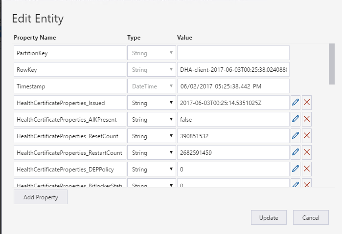

# Device Health Attestation

Modern malware is getting more and more sophisticated.  Some of them, specifically bootkits, are capable of starting before Windows.  **Device Health Attestation** can be used to detect and remediate in the unlikely event where a device is infected.  The device's firmware logs the boot process, and Windows can send it to a trusted Health Attestation Server that can objectively assess the device's health.  See [Device Health Attestation architecture](dha-architecture.md) for more details.

Before this functionality can be used, additional Azure resources need to be deploy.  See the [deployment page](dha-deploy.md) for more details.

The **Device Health Attestation** functionality allows the operator to perform the following tasks:

- Schedule health attestation
- Initiate immediate health attestation
- Retrieve health attestation status
- Retrieve health attestation report
- Take remedial actions

## Schedule Health Attestation

The **Schedule health attestation** operation is initiated by the device receiving the `"desired.microsoft.management.scheduledReboot"` desired property.

### Configuration Format
The format of the `"desired.microsoft.management.deviceHealthAttestation"` desired property is as follows:

<pre>
"desired" : {
    "microsoft" : {
        "management" : {
            "deviceHealthAttestation" :{
                "Endpoint" : "<i>see below</i>"
                "ReportIntervalInSeconds" : "<i>see below</i>"
            }
        }
    }
}
</pre>

- ```"Endpoint"``` : Health Attestation Server URI.  When set to an empty string, the default Microsoft Health Attestation Server will be used.  See [this page](https://technet.microsoft.com/en-us/library/mt750346.aspx) on how to setup a custom Health Attestation Server.
- ```"ReportIntervalInSeconds"``` : Interval in seconds to perform health attestation.  When set to ```"0"```, health attestation will be perform only once during startup.  When set to ```"-1"```, health attestation will be disabled.

**Examples**

Perform a health attestation every hour against the default Microsoft Health Attestation Server, ```has.spserv.microsoft.com```:

```
"desired" : {
    "microsoft" : {
        "management" : {
            "deviceHealthAttestation" : {
                "Endpoint" : "has.spserv.microsoft.com"
                "ReportIntervalInSeconds" : "3600"
            }
        }
    }
}
```

## Retrieve Health Attestation Status

*After* the device attests, the `"reported.microsoft.management.deviceHealthAttestation.status"` property is set, which is defined as follows:

<pre>
"reported" : {
    "microsoft" : {
        "management" : {
            "deviceHealthAttestation" : {
                "status": "<i>Status of last health attestation</i>",
                "TimeStamp": "<i>Datetime in ISO 8601 format, UTC</i>"
            }
        }
    }
}
</pre>


## Initiate Immediate Health Attestation

The **Immediate Health Attestation** operation is initiated by the device receiving the `microsoft.management.deviceHealthAttestationReportNow` method.

### Input Payload
Input payload is empty

### Output Payload
The device responds immediately with the following JSON payload:

<pre>
"response" : "<i>see below</i>"
"reason" : "<i>see below</i>"
</pre>

- ```"response"``` : This can either be set to ```"accepted"``` or ```"rejected"```. In case it is set to ```"rejected"```, the ```"reason"``` field will contain more details on why the method has been rejected..
- ```"reason"``` : If the ```"response"``` is ```"accepted"```, this will be empty - otherwise, this field will contain more details on why the method has been rejected.

The state of the latest request is communicated to the back-end via
reported properties as described in Retrieve Health Attestation Status.


**Examples:**

Successful response:

```
{
     "response" : "accepted"
     "reason" : ""
}
```
## Retrieve Health Attestation Report

*After* the device attested successfully, a health report is generated.  This report is stored in the Azure storage table, ```dhaReportTable```.  Each row represent a single health report.  The ```rowkey``` is generated using the format ```<device name>-<timestamp of report>```.  For example, ```DHA-client-2017-06-03T00:25:38.0240880Z```.  This table can be accessed via GUI using [Azure Storage Explorer](http://storageexplorer.com/) or programmatically through [Azure table storage APIs](https://docs.microsoft.com/en-us/azure/storage/storage-dotnet-how-to-use-tables#retrieve-a-range-of-entities-in-a-partition).

Here is a screen shot of a sample report viewed through the Azure Storage Explorer.



Please, see [Device HealthAttestation CSP](https://docs.microsoft.com/en-us/windows/client-management/mdm/healthattestation-csp#a-href-idtake-policy-actionastep-8-take-appropriate-policy-action-based-on-evaluation-results) for more details about each field.

## Take remedial actions

After a health report has been generated, the operator can optionally take remedial actions if the device's health is not compliant.

For example, the operator can perform a "factory reset" to bring the device back to a known state.

```
    public async Task ProcessHealthReportAsync(HealthReport report)
    {
        if (!IsDeviceCompliance(report))
        {
            await FactoryResetAsync(report.DeviceId);
        }
    }

    private bool IsDeviceCompliance(HealthReport report)
    {
        // Ensure secure boot is enabled.
        bool secureBootEnabled;
        if (!bool.TryParse(report.HealthCertificateProperties["SecureBootEnabled"], out secureBootEnabled))
        {
            return false;
        }

        return secureBootEnabled;
    }

    private async Task FactoryResetAsync(string deviceId)
    {
        // Invoke device method
        dynamic param = new {
            recoveryPartitionGUID = "<your recovery partition GUID>",
            clearTPM = false
        };
        var json = JsonConvert.SerializeObject(param);
        var cloudToDeviceMethod = new CloudToDeviceMethod("microsoft.management.factoryReset");
        cloudToDeviceMethod.SetPayloadJson(json);

        var result = await _iotHubServiceClient.InvokeDeviceMethodAsync(deviceId, cloudToDeviceMethod);
        _log.Info($"FactoryResetAsync status: {result.Status}");
    }
```

See [HealthInspector sample code](../src/DHA/DHA/DHAServiceBusQueueHandler/HealthInspector.csx) for details.

----

[Home Page](../README.md) | [Library Reference](library-reference.md)