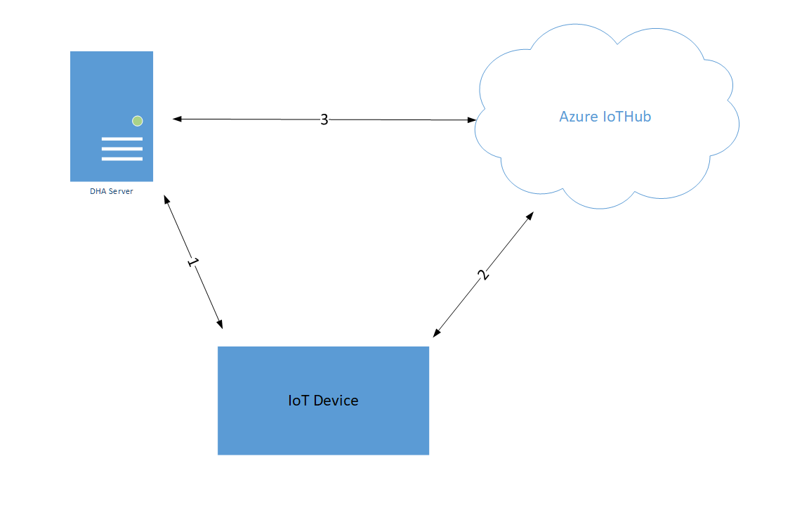
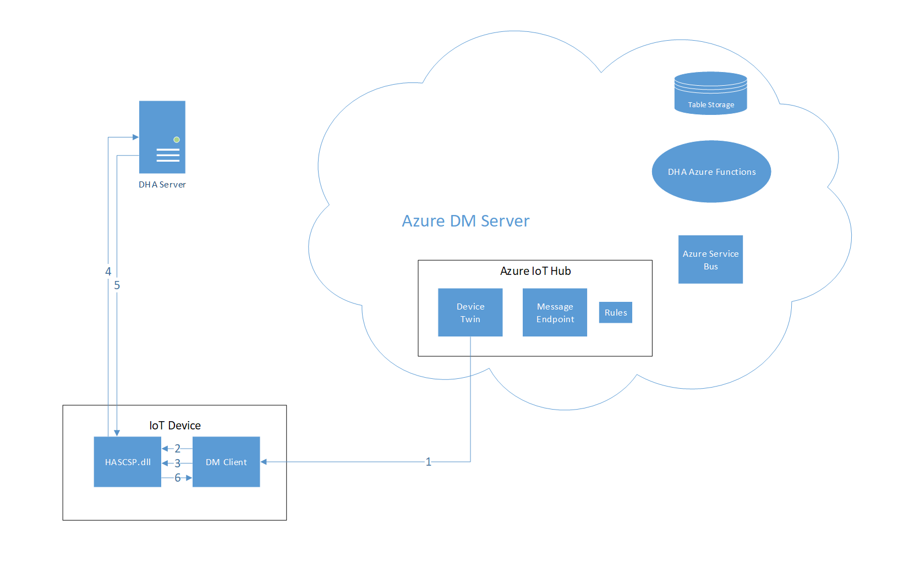
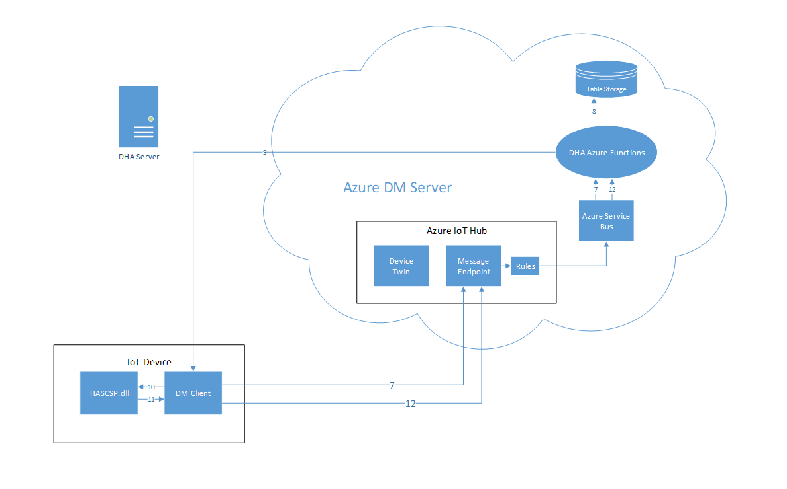
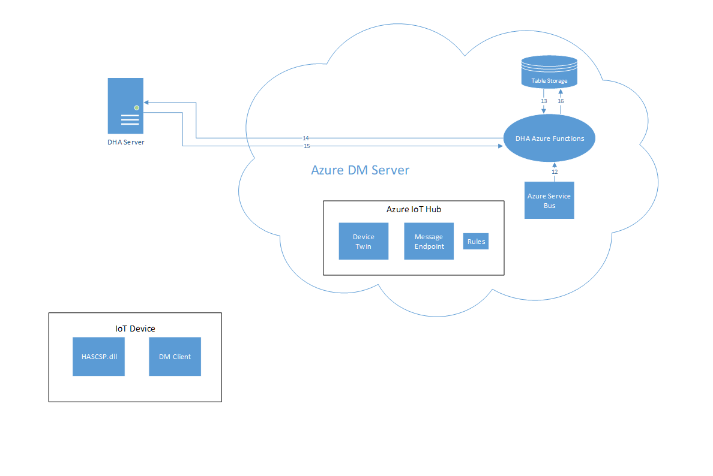

# Windows IoT Device Health Attestation Architecture

## Overview

Windows IoT Device Health Attestation enables the operator to assess if a device is booted to a trusted and compliant state, and take appropriate remedial actions if necessary through [Azure IoT Hub Device Management](../README.md).

## Requirements

- Device with Trusted Platform Module (TPM) 2.0
- Endorsement Key Certificate (EK certificate) issued by the TPM vendor

## Data Flow Overview
Here's a diagram of the basic data flow.  



This is divided into 3 parts:

1.	Device sends boot data ```DHA-BootData``` to DHA-Server.  DHA Server replies with an encrypted data blob ```DHA-EncBlob```
2.	Azure IotHub sends a ```Nonce``` to Device.  Device sends encrypted data blob ```DHA-EncBlob``` and a signed ```DHA-SignedBlob``` data blob to Azure IotHub
3.	Azure IotHub posts data it received from device to DHA Server.  DHA Server reviews the data it receives, and replies with a device health report ```DHA-Report```.

### Terminology:

- ```DHA-BootData```: the device boot data (TCG logs, PCR values, device/TPM certificate, boot and TPM counters) that are required for validating device boot health.
- ```DHA-EncBlob```: an encrypted summary report that DHA-Service issues to a device after reviewing the DHA-BootData it receives from devices.
- ```DHA-SignedBlob```: it is a signed snapshot of the current state of a device?s runtime that is captured by DHA-CSP at device health attestation time.
- ```DHA-Report```: the report that is issued by DHA-Service 
- ```Nonce```: a crypto protected number that is generated by MDM-Server, which protects the DHA-Session from man-in-the-middle type attacks


## Data Flow Detailed

The following breaks down each of the three steps in detail:



1.	On device boot, DM-client retrieve the DHA-server endpoint from the device twin.
2.	DM-client sets the endpoints in the HASCSP using SyncML ```./Vendor/MSFT/HealthAttestation/HASEndpoint```
3.	DM-client tells HASCSP to send a health verification request to DHA-service using SyncML  ```./Vendor/MSFT/HealthAttestation/VerifyHealth```
4.	Device sends boot data (DHA-BootData) to DHA-Service 
5.	DHA-Service replies with an encrypted data blob (DHA-EncBlob)
6.	DM-client gets status of the current health verification request using SyncML ```./Vendor/MSFT/HealthAttestation/Status```




7.	When DM-client wants report health status to Azure-DM-server, the DM-client will send a device-to-cloud message to request a nonce from Azure-DM-server.  
	- To separate this health attestation message from other telemetry messages, the message will have the property ```MessageType=DHA-*```  And a [routing rule](https://azure.microsoft.com/en-us/blog/azure-iot-hub-message-routing-enhances-device-telemetry-and-optimizes-iot-infrastructure-resources/) will redirect these messages to an azure service bus. 
	-	The service bus, upon receiving a message, will trigger the execution of DHA-Azure-Functions.
8.	DHA-Azure-Functions generates a random nonce and store the nonce along with the device name into the Azure-Table-Storage.
9.	DHA-Azure-Functions invoke a direct method (with nonce as a parameter) on the DM client.
10.	DM-client passes the nonce to HASCSP using SyncML ```./Vendor/MSFT/HealthAttestation/Nonce```
11.	DM-client gets the DHA-EncBlob and DHA-SignedBlob from HASCSP using SyncML ```./Vendor/MSFT/HealthAttestation/Certificate```
12.	DM-client sends DHA-EncBlob and DHA-SignedBlob via device-to-cloud message.



13.	Since azure functions are stateless, DHA-Azure-Functions needs to retrieve the nonce generated for that device in step 8 from the Azure-Table-Storage.
14.	DHA-Azure-Functions sends the nonce, DHA-EncBlob, and DHA-SignedBlob to the DHA-service.
15.	DHA-Service reviews the data and replies with a device health report (DHA-Report).
16.	DHA-Azure-Functions stores the DHA-Report in the Azure-Table-Storage.

----

[Home Page](../README.md) | [Library Reference](library-reference.md)
