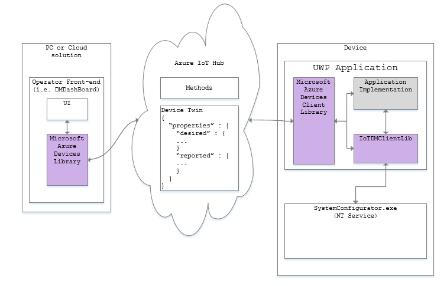

# Device Management Client Architecture

Here's a diagram of how the different pieces fit together:

All device management operations are implemented via the Azure IoT Hub [direct methods](<https://docs.microsoft.com/en-us/azure/iot-hub/iot-hub-devguide-direct-methods>) and the [device twin](<https://docs.microsoft.com/en-us/azure/iot-hub/iot-hub-devguide-device-twins>).

----

[Home Page](../README.md)