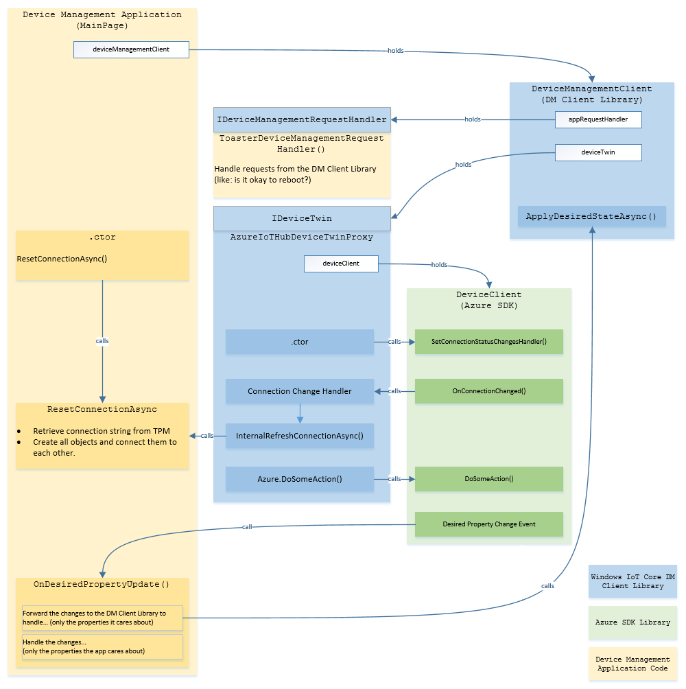

# Library Reference

A set of device management capabilities are exposed through the **Windows IoT Azure DM Client Library** (DM Client Library for short). This library can be used in an UWP application where the application creates and owns the connection to the Azure IoT Hub.

This means that both the application and the DM Client Library will share the connection to Azure IoT Hub - and hence, both should be aware of each other.

Here is the high-level of the responsibilities of each and how they should coordinate:

- The Application
  - Creates the connection to Azure IoT Hub and owns it.
  - Registers its own callback to listen to device twin changes. In that callback, it should forward the changes to the DM Client library so that changes recognized by the library are handled. The application is free to handle the same changes should it needs to.
- The DM Client Library
  - Takes a reference to that connection upon its construction so that it can update the device twin directly without going through the application.
  - Registers its own direct methods. The application is not involved in that step - however, it worth noting that the application may register a handler for a method already handled by the DM Client Library. This might be intentional on the user's part - if not, the user should make sure any direct method being registered does not conflict with those defined by the the DM Client Library (they all start with "`windows.`").
  - Requires an abstraction of the cloud SDK interface (`IDeviceTwin` implementation). This is a requirement to make switching the Azure SDK with an on-prem implementation easy. The DM Client Library provides an implementation for Azure SDK (`AzureIoTHubDeviceTwinProxy`).
  - Requires a  way to callback the application asking questions (like; "can I reboot now?"). This is represented by `IDeviceManagementRequestHandler` interface. The **application** provides this implementation.

Below is a diagram illustrating these relationships:



## Interface

The **Windows IoT Azure DM Client Library** exposes its capabilities through two main mechanisms:

1. Azure's Device Twin and Direct Methods (with json as the underlying data format).
2. .NET APIs.

The .NET API mechanism is supported when it makes sense for the Device Management Application to have such control.

#### Direct Method Format

Some device management actions are initiated by direct methods. Such methods start with the `windows` prefix followed by the method name. The method payload (when non-empty) is in JSON format. The return payload (if not empty) is also in JSON format.

Example:

```
windows.transmogrify
```

The payload for a method can look as follows:
```
"parameter" : "value"
```

The exact specification for each device management operation is defined in the [Specification](#specification) below.

#### Device Twin Format

Certain device management operations are initiated by desired properties set from the IoT Hub. For example, some configuration settings are set by the desired properties as depicted in the example below:

```
"desired": {
    "windows" : { 
        "key1" : value1,
        "key2" : value2,
        ...
    }
    ...
}
```

### Capabilities

- [Application Management](application-management.md)
- [Certificates Management](certificate-management.md)
- [Device Information](device-info.md)
- [Device Factory Reset](device-factory-reset.md)
- [Device Health Attestation](device-health-attestation.md)
- [Diagnostics Logs](diagnostic-logs-management.md)
- [Reboot Management](reboot-management.md)
- [Time Management](time-management.md)
- [WiFi](wifi-management.md)
- [Windows Telemetry Management](windows-telemetry-management.md)
- [Windows Update Management](windows-update-management.md)

### General

- [Status Reporting](status-reporting.md)
- [Apply All Desired Properties](apply-all-desired-properties.md)
- [Report All Device Properties](report-all-device-properties.md)
- [Debugging Azure Device Management Client](debugging.md)
- [Source Policy](source-policy.md)
- [Running End-To-End Tests](running-e2e-tests.md)

----

[Home Page](../README.md)