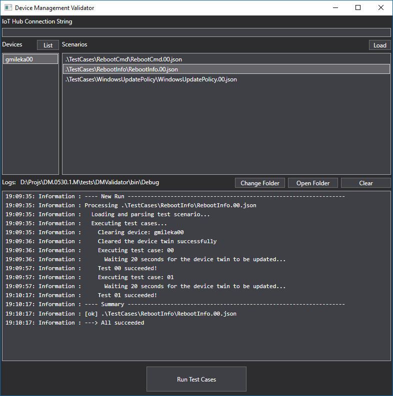

# Running End-To-End Tests

There are two ways provided for running end-to-end tests:

1. Using mocked Azure services.
2. Using live Azure services.

## Using Mocked Azure Services

A UWP app (tests/E2ETestApp) uses mocks of Azure services along with IoTDMClientLib to exercise a set of tests (tests/E2ETestApp/TestCases) and then verify the responses.

The UWP app talks to a real SystemConfigurator that actually modifies the host OS.

Both the test app and SystemConfigurator need to be running on the same machine.

Below are the steps necessary to build and run the tests:

- Build the solution for all three architectures.
- Deploy systemconfigurator.exe to the device and register/start the service.
- Create a nuget using the flavor you have built (i.e. debug or release).
- Add the nuget to the E2ETestApp.
- If you are running scenarios that depend on Azure storage, under E2ETestApp/TestInfrastructure/TestParameters.cs, fill in the parameters necessary (like Azure storage connection string, etc). Those scenarios are:
  - Application install scenarios.
  - Certificate install scenarios.
  - WiFi profile install scenarios.
- Build the E2ETestApp.
- Deploy E2ETestApp using Visual Studio (F5).
- Select the tests you want to run and click Execute.

To get detailed logs,

- Look at the debug output if you are running E2ETestApp under the debugger.
- Collect the ETW logs as you would normally do for IoT Core Azure DM client ([see this page](debugging.md)).

## Using Live Azure Services

An win32 app (tests/DMValidator) uses the live Azure services to talk to a DM application running on the device and goes through exercising a set of tests (test/DMValidator/TestCases) and then verifies the responses.

The test app talks to Azure services (IoT Hub), which in turn notifies the DM application running on the device. The DM application is expected to handle the notifications appropriately and report back to IoT Hub. The test app will check later to see if the expected responses are present in IoT Hub or not.

Below are the steps necessary to build and run the tests:

- Build the solution for all three architectures.
- Deploy your DM client bits to the device and launch it.
  - Copy/register/start systemconfigurator.exe.
  - Deploy/launch the Toaster app.
- Build/launch DMValidator.
- Enter the IoT Hub owner connection string, select the target device to run the tests, and select the tests, then click 'Run Test Cases'.

To get details logs,
- Look at the debug output if you are running E2ETestApp under the debugger.
- Collect the ETW logs as you would normally do for IoT Core Azure DM client ([see this page](debugging.md)).
- Inspect the log files created by the tools.

----

[Home Page](../README.md) | [Library Reference](library-reference.md)